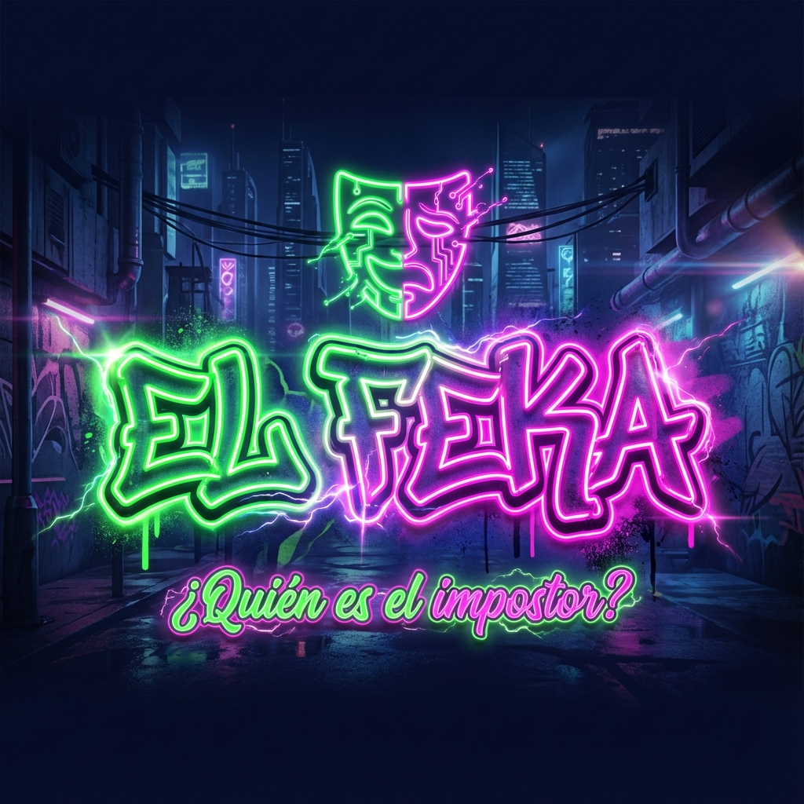

# 🎭 EL FEKA - Juego del Impostor

<p align="center">
  
</p>

<p align="center">
  <strong>¿Quién es el FEKA?</strong> El juego social de engaño y diversión para jugar con tus parceros.
</p>

<p align="center">
  <a href="https://elfeka.vercel.app">🎮 Jugar Ahora</a> •
  <a href="#características">Características</a> •
  <a href="#instalación">Instalación</a> •
  <a href="#tecnologías">Tecnologías</a>
</p>

---

## 🎯 ¿Qué es El Feka?

**El Feka** es un party game social donde los jugadores deben descubrir al impostor (el "FEKA") antes de que engañe a todos. Inspirado en juegos como Spyfall, pero con un toque latino y urbano.

### Cómo Jugar

1. **Configuración**: Selecciona el número de jugadores (3-15) y una categoría
2. **Roles**: Cada jugador ve su rol en secreto - los REALES conocen la palabra, el FEKA no
3. **Discusión**: Todos debaten dando pistas sutiles sobre la palabra
4. **Votación**: Identifica y vota por quién crees que es el FEKA
5. **Resultados**: ¡Descubre si los REALES ganaron o si el FEKA logró engañar!

---

## ✨ Características

- 🎨 **Diseño Urbano Neón** - Estética moderna con colores vibrantes
- 📱 **PWA Instalable** - Juega sin conexión después de la primera visita
- 🎯 **7 Categorías** - Deportes, Tecnología, Ciencia, Alimentos, Cine, NERD y ASERE 🇨🇺
- ⏱️ **Timer Circular** - Visualiza el tiempo de discusión con estilo
- 📳 **Haptic Feedback** - Retroalimentación táctil en dispositivos móviles
- 🔒 **Wake Lock** - La pantalla no se apaga durante el juego
- 👆 **Gestos Swipe** - Desliza para pasar al siguiente jugador
- 📖 **Reglas Integradas** - Guía rápida accesible en cualquier momento

---

## 🛠️ Instalación

### Prerrequisitos

- Node.js 18+
- npm o pnpm

### Desarrollo Local

```bash
# Clonar el repositorio
git clone https://github.com/thejasondev/el-feka-game.git
cd el-feka-game

# Instalar dependencias
npm install

# Iniciar servidor de desarrollo
npm run dev
```

Abre [http://localhost:3000](http://localhost:3000) en tu navegador.

### Build de Producción

```bash
npm run build
npm start
```

---

## 🚀 Tecnologías

| Tecnología        | Uso                            |
| ----------------- | ------------------------------ |
| **Next.js 16**    | Framework React con App Router |
| **React 19**      | Biblioteca UI                  |
| **TailwindCSS 4** | Estilos                        |
| **shadcn/ui**     | Componentes UI                 |
| **Vaul**          | Drawer/Sheet components        |
| **Vercel**        | Hosting                        |

---

## 📁 Estructura del Proyecto

```
el-feka-game/
├── app/
│   ├── layout.tsx      # Layout principal + SEO
│   ├── page.tsx        # Lógica del juego
│   ├── globals.css     # Estilos globales
│   └── sitemap.ts      # SEO
├── components/
│   └── game/
│       ├── setup-screen.tsx      # Configuración inicial
│       ├── player-setup.tsx      # Ingreso de nombres
│       ├── role-reveal.tsx       # Revelación de roles
│       ├── timer-phase.tsx       # Fase de discusión
│       ├── individual-voting.tsx # Votación
│       ├── results-screen.tsx    # Resultados
│       ├── rules-sheet.tsx       # Drawer de reglas
│       └── footer.tsx            # Créditos
├── lib/
│   ├── game-data.ts    # Categorías y palabras
│   └── haptics.ts      # Feedback táctil
├── hooks/
│   └── use-swipe.ts    # Detección de gestos
└── public/
    ├── manifest.json   # PWA config
    ├── sw.js           # Service Worker
    └── *.png           # Iconos y assets
```

---

## 🎮 Categorías de Palabras

| Categoría  | Emoji | Descripción                             |
| ---------- | ----- | --------------------------------------- |
| Deportes   | ⚽    | Fútbol, boxeo, MMA...                   |
| Tecnología | 📱    | iPhone, Bitcoin, TikTok...              |
| Ciencia    | 🔬    | Átomo, NASA, ADN...                     |
| Alimentos  | 🍔    | Tacos, sushi, asado...                  |
| Cine       | 🎬    | Netflix, Oscar, thriller...             |
| NERD       | 🤓    | Mitocondria, Schrödinger, blockchain... |
| ASERE      | 🇨🇺    | Yuma, guagua, paladar...                |

---

## 📄 Licencia

Este proyecto está bajo la Licencia MIT.

---

## 👨‍💻 Autor

Desarrollado por [@thejasondev](https://instagram.com/thejasondev)

---

<p align="center">
  <strong>¡Descubre al FEKA antes de que sea tarde!</strong>
</p>
